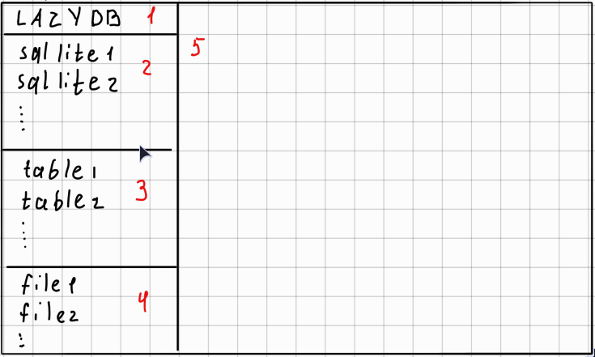

## «Терминальный менеджер баз данных SQLite»

## Введение

### Актуальность темы
В современной разработке программного обеспечения часто возникает необходимость быстрого и удобного взаимодействия с базами данных без запуска тяжёлых графических клиентов. Терминальные интерфейсы (TUI) позволяют эффективно работать с базами данных на удалённых серверах, в средах с ограниченными ресурсами или просто в рамках рабочего процесса, ориентированного на клавиатуру.

### Цель и задачи работы
Целью данной курсовой работы является разработка терминального менеджера для баз данных SQLite, обеспечивающего:
- подключение и переключение между несколькими базами данных;
- просмотр, добавление и удаление таблиц;
- просмотр и редактирование содержимого таблиц;
- работу с SQL-файлами (скрипты, триггеры, процедуры);
- выполнение SQL-запросов из файлов.

### Практическая значимость
Разработанное приложение может быть использовано разработчиками, администраторами баз данных и студентами для повседневных задач при работе с SQLite в терминале.

## Аналитический обзор

### Существующие аналоги
На сегодняшний день существуют следующие инструменты для работы с SQLite:
- **SQLite3 CLI** — стандартная командная строка, минималистична, но неудобна для интерактивной работы с несколькими таблицами.
- **LiteCLI** — улучшенная CLI с автодополнением, но без многопанельного интерфейса.
- **DB Browser for SQLite** — графический инструмент, требует X-сервера или графической оболочки.

### Обоснование выбора подхода
Проект вдохновлён интерфейсом LazyGit (многопанельный TUI), что позволяет совместить мощность клавиатурного управления с наглядностью представления данных. Выбор языка Rust обусловлен его производительностью, безопасной работой с памятью и богатой экосистемой для создания TUI.

## Проектирование

### Архитектура приложения
Приложение строится по модульному принципу:
- **Модуль TUI** — отвечает за отрисовку интерфейса, обработку клавиатурных событий.
- **Модуль БД** — инкапсулирует работу с SQLite через SQLx.
- **Модуль файлового менеджера** — работает с файловой системой (SQL-скрипты).
- **Модуль редактирования** — обеспечивает интерактивное редактирование ячеек таблиц и текста файлов.

### Структура интерфейса
Главное окно разделено на пять панелей (см. рис. 1):
1. Информационная панель (проект, автор, ссылки).
2. Список баз данных.
3. Список таблиц активной БД.
4. Список файлов (SQL, триггеры, процедуры).
5. Динамическая панель (содержимое таблицы/файла + редактирование).

**Рисунок 1 — Макет интерфейса**

### Навигация и управление
- **Переключение между панелями:** клавиши ← и →.
- **Выбор элемента в панели:** клавиши ↑ и ↓.
- **Открыть/редактировать:** Enter.
- **Добавить:** Shift + A.
- **Удалить:** Shift + D.
- **Выполнить SQL-файл:** Shift + E.

## Реализация

### Требования к техническому обеспечению
- Операционная система: Linux, Windows (с поддержкой ANSI-терминалов);
- Терминал: не менее 80×25 символов, поддержка 256 цветов;
- Наличие установленной среды выполнения Rust (не требуется для пользователя, только для сборки).

### Выбор инструментов
- **Rust** — основной язык разработки.
- **Ratatui** — библиотека для построения TUI.
- **Crossterm** — обработка событий терминала.
- **SQLx** — асинхронная работа с SQLite (с проверками на этапе компиляции).

## Заключение
В ходе выполнения курсовой работы был разработан терминальный менеджер баз данных SQLite, полностью соответствующий поставленным задачам. Приложение предоставляет удобный многопанельный интерфейс, быструю навигацию и возможность редактирования данных. В дальнейшем планируется добавить поддержку синтаксиса SQL при редактировании файлов и расширить возможности импорта/экспорта данных.

---

# Полный перечень сочетаний клавиш

| Действие                                   | Сочетание    |
|--------------------------------------------|--------------|
| Переключение между окнами                  | ← / →        |
| Навигация внутри окна (выбор элемента)     | ↑ / ↓        |
| Добавить базу данных / таблицу / файл      | Shift + A    |
| Удалить базу данных / таблицу / файл       | Shift + D    |
| Выполнить SQL-файл                         | Shift + E    |
| Открыть / перейти в режим редактирования   | Enter        |
| Выход из программы                         | Ctrl + C / Q |
